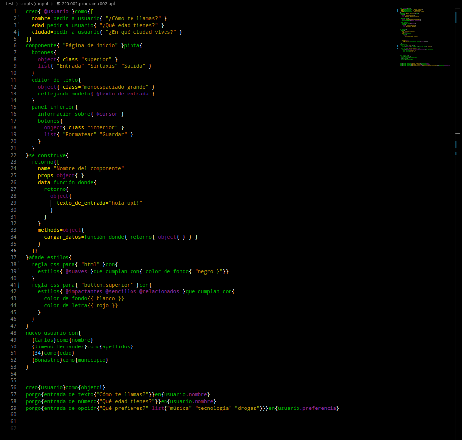

# Universal Programming Language

Most pretencious programming language in the world. But ambitious too.

## Index

- [Universal Programming Language](#universal-programming-language)
  - [Index](#index)
  - [Requirements](#requirements)
  - [Installation](#installation)
    - [Using npm](#using-npm)
    - [Using git](#using-git)
  - [Syntax highlighter](#syntax-highlighter)
  - [Syntax examples](#syntax-examples)
  - [Syntax fastly explained](#syntax-fastly-explained)
  - [Online editor](#online-editor)
- [The «bla bla bla» part](#the-bla-bla-bla-part)
  - [Why?](#why)
  - [How?](#how)
  - [Examples](#examples)
  - [Usage](#usage)
    - [Via API](#via-api)
      - [Example](#example)

## Requirements

You need `npm` and `node`. Minimum `node`.

Developed and tested in `node@18.17.1`.

## Installation

### Using npm

```
npm install @allnulled/universal-programming-language
```

Use `--global` or `-g` flag to install the command line binary automatically.


### Using git

```
git clone https://github.com/allnulled/universal-programming-language
npm install
```

## Syntax highlighter

Install your syntax highlighter for Visual Studio Code from `vsix` file directly at: [vscode-extension/upl-vscode-extension.vsix](./vscode-extension/upl-vscode-extension.vsix)

## Syntax examples



## Syntax fastly explained

You have primitives:

- **Text:** `"This is a text. Can be multiline. Can escape with \". Cannot chain."`
- **Number:** `-100.50`
- **Object:** `object{ name="Carlos" surname="Jimeno" age="greater than you, always" }`
- **List:** `list{ 0 1 2 3 4 5 }`

You have higher-level expressions:

- **Molecule:**
  - `word word{ @parameter @parameter }word word{ @parameter @parameter }`
- **Covalent molecule:**
  - `{ @parameter @parameter }word word{ @parameter @parameter }`
- **Atom:**
  - `word word{ @parameter }`
- **Variable access type 1:**
  - `@whatever.access.deeper`
- **Variable access type 2:**
  - `@whatever["access"]["deeper"]`
- **Variable call type 1:**
  - `@whatever.function{ @parameter @parameter }`
- **Variable call type 2:**
  - `@whatever.function!`
- **Comment:**
  - `comment{{ This is a comment }}`
- **Function shortcut (only in the header of the script):**
  - `#func shortcut=real function name`
  - `#func shortcut usage{ "same as functions" }`

Then you have piping:

- **Pipe type 1:**
  - `@whatever | expression{ @ }`
- **Pipe type 2:**
  - `@whatever |= expression{ @ }`
- **Pipe type 3:**
  - `@whatever |[ "name" ] expression{ @ }`
- **Pipe type 4:**
  - `@whatever |[ "name" ]= expression{ @ }`
- **Pipe type 5:**
  - `@whatever |@chainable.varname expression{ @ }`
- **Pipe type 6:**
  - `@whatever |@chainable.varname= expression{ @ }`


## Online editor

Online editor has no syntax highlight in order to keep compatibility with mobile phone browsers (at least, the mine does not work well with CodeMirror and others, so out).

But here you can: (this part is still in progress)

- [https://allnulled.github.io/universal-programming-language/editor/](https://allnulled.github.io/universal-programming-language/editor/)

**Note:** use `*.up` or `*.upl` files in order to let `Format` button to beautify `upl` source codes. It also supports `html`, `css` and `js`.

# The «bla bla bla» part

## Why?

- With `upl` you can represent any other syntax of the world. That is what why the 'universal' thing of it.
- With `upl` you can make any other syntax of the world transpile to what you want. This is the layer I give. You can have preset transpilers (to get javascript, java, php, bash, whatever), but the core of the language is abstraction only.

## How?

Molecules. Syntactical molecules. The language works through tokenizing what I have called "syntactical molecules". By this concept, which is a (PEG) syntax under the hood extendable by a specific API, you can reproduce «any other language» or «layer of abstraction».

## Examples

For example:

```
create{ @x }as{ 100 }
create{ @y }as{ 200 }
print{ concat text{ @x @y } }
```

Here, we have 3 (structurally) different molecules, and here is the formula representation of them:
  - `create{$1}as{$2}`
  - `print{$1}`
  - `concat/text{$1}`

Yes, molecules are defined through formulas. But also programmatically, you can choose.

The meaning, when transpiling, of the 3 molecules, is up to the transpiler you choose itself. By default, it has no real meaning in a programmatic world, further than the JSON of the AST you get.

## Usage

### Via API

It is on `dist/upl.js`.

Both, `node.js` and `browser` environments are supported by the same `upl.js` file, and:
  - It can be imported via `import "dist/upl.js"`
  - It can be imported via `require("dist/upl.js")`
  - It can be imported via `<script src="dist/upl.js"></script>`

For example:

```js
const upl = require("upl");
```

The global `upl` is a class that has these **static** properties and methods:

- `classes`: 
  - `parser`: the object that parses. Not a class strictly.
  - `formatter`: the class that creates the formatter used in `format`.
  - `transpiler`: the class that creates the transpiler used in `transpile`.
- `default_parse_options`: 
  - `trace`: `true` by default.
  - `mode`: `"ast"` by default, but it could be also: `"transpile"` or `"format"`.
- `parse(text, options = this.default_parse_options)`: this method parses `upl` syntax using the mode you provide.
- `parse_to_ast(...args)`: same than previous, but always uses `"ast"` mode.
- `format(text, options = this.default_parse_options)`: same than previous, but always uses `"format"` mode.
- `create(...args)`: returns a new instance passing the same arguments. It just wraps the `new` operator by an async method.
- `createTranspiler(known_syntaxes = [])`: this method returns a new instance of the parser, but stucking the known syntaxes that the transpiler can work with. See **dynamic methods** to check the API of the object returned (an object of this same class).

The global `upl` can create objects of itself through:
  - `new` operator, like: `new upl(...args)`
  - `create` static method, like: `upl.create(...args)`
  - `createTranspiler` static method, like: `upl.createTranspiler(...args)`

The global `upl` can create, then, objects that has these **dynamic** properties and methods:

- `parse`: same as static version, but supporting "transpile" (the static `parse` does not because *the language is unopinionated on transpilation pipe by default*).
- `parse_to_ast`: same as static version.
- `format`: same as static version.
- `transpile`: from this method, you can get JavaScript, PHP, Java, or whatever.

Right now, this is everything. The transpiler is in process yet.

#### Example

To get the AST or format code, you can:

```js
const upl = require("upl");
const ast = upl.parse("create{ @x }as{ 200 }");
const code = upl.format("create{ @x }as{ 200 }");
```

To get a transpiler, the API is still in progress, but:

```js
const upl = require("upl");
const transpiler = upl.createTranspiler([{ ... }, { ... }, { ... }]); // { ... } are the syntaxes objects
const output = transpiler.transpile("create{ @x }as{ 200 }");
```

